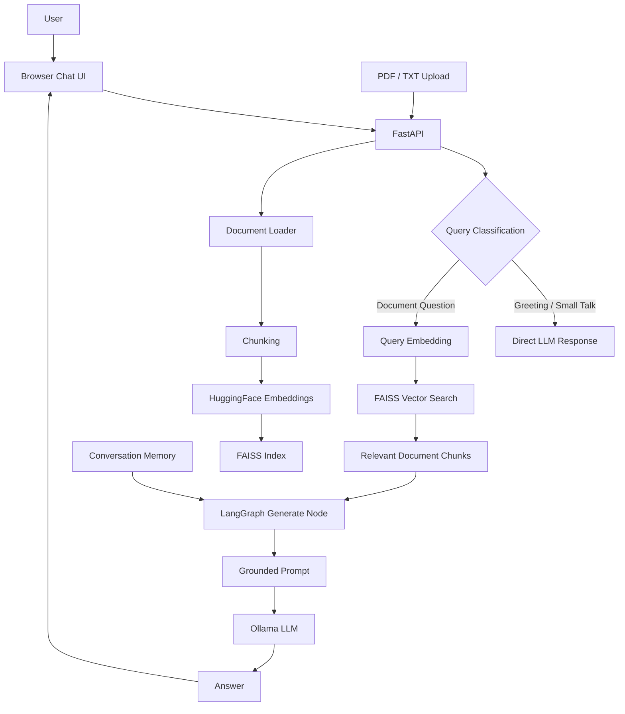
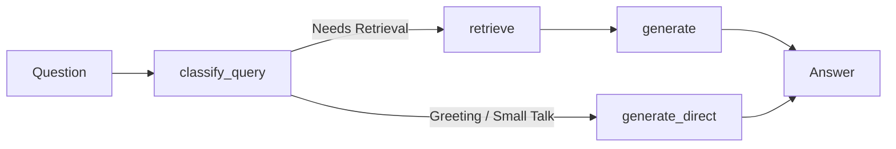

# DocQA — RAG-Based Document Q&A

> **Ask questions about your own documents using Retrieval-Augmented Generation (RAG).**

DocQA is an AI-powered document question-answering application built with **FastAPI, LangChain, LangGraph, FAISS, HuggingFace Sentence Transformers, and Ollama**.

Users can upload PDF/TXT documents, select a specific document, ask natural-language questions, and receive answers grounded in the retrieved document content.

The project also demonstrates **document-aware retrieval, conversation memory, conditional LangGraph routing, local embeddings, local LLM inference, and a browser-based chat interface**.

---

## ✨ Features

* 📄 Upload **PDF and TXT** documents
* 🔎 Semantic document search using **FAISS**
* 🧠 Local text embeddings with **Sentence Transformers**
* 🤖 Local LLM inference using **Ollama**
* 🧩 Conditional workflow using **LangGraph**
* 💬 Session-based conversation memory
* 🎯 Document-specific retrieval
* 🚫 Grounded responses with "I don't know" behavior when context is insufficient
* ⚡ Retrieval bypass for simple greetings/small-talk
* 🌐 Browser-based chat interface
* 📚 Automatic FAISS re-indexing after document upload
* 🔌 REST API with FastAPI
* 📖 Interactive Swagger API documentation
* 🐳 Docker Compose configuration
* 🔐 No external LLM API key required for local usage

---

# 🏗️ System Architecture



---

# 🔄 RAG Pipeline

DocQA follows a standard Retrieval-Augmented Generation pipeline:

```text
Documents
    │
    ▼
Load PDF / TXT
    │
    ▼
Chunk Documents
    │
    ▼
Generate Embeddings
    │
    ▼
FAISS Vector Index
    │
    │
    │ User Question
    ▼
Question Embedding
    │
    ▼
Similarity Search
    │
    ▼
Top-K Relevant Chunks
    │
    ▼
LangGraph
    │
    ▼
Grounded Prompt
    │
    ▼
Ollama LLM
    │
    ▼
Final Answer
```

### 1. Load

PDF and TXT files are loaded from:

```text
data/sample_docs/
```

Supported formats:

* `.pdf`
* `.txt`

### 2. Chunk

Large documents are split using:

```text
RecursiveCharacterTextSplitter
```

Current configuration:

```text
Chunk size: 500 characters
Overlap:     80 characters
```

The overlap helps preserve context when a sentence or idea crosses a chunk boundary.

### 3. Embed

Each chunk is converted into a numerical vector using:

```text
sentence-transformers/all-MiniLM-L6-v2
```

The model produces **384-dimensional embeddings** and runs locally.

### 4. Store

Embeddings are stored in a local:

```text
FAISS
```

vector index.

FAISS allows semantic similarity search instead of relying only on exact keyword matching.

### 5. Retrieve

When the user asks a question:

```text
Question
   ↓
Question Embedding
   ↓
FAISS Similarity Search
   ↓
Top 4 Relevant Chunks
```

The default retrieval value is:

```text
TOP_K = 4
```

### 6. Generate

Retrieved chunks are inserted into a grounded prompt and sent to the local Ollama model.

The prompt instructs the model to:

* use the supplied document context
* use conversation history for follow-up questions
* avoid inventing information
* say it doesn't know when the answer is not available

---

# 🧩 LangGraph Workflow

LangGraph is used to orchestrate the application flow.



### Query classification

The first node determines whether retrieval is required.

For example:

```text
"Hello"
"Hi"
"Thanks"
```

can bypass document retrieval.

A document-related question follows the RAG path.

This demonstrates **conditional/stateful orchestration** instead of a simple linear chain.

---

# 🎯 Document-Aware Retrieval

DocQA supports selecting a specific document from the UI.

Example:

```text
All Documents
    ├── Resume.pdf
    ├── Bexra_School_Product_Blueprint.pdf
    └── company_policy.txt
```

If the user selects:

```text
company_policy.txt
```

the retrieval operation is restricted to that document.

This prevents unrelated documents from being returned as context.

Without document filtering:

```text
Question
   ↓
Search all documents
   ↓
Potentially unrelated chunks
```

With document filtering:

```text
Question
   ↓
Selected document
   ↓
FAISS similarity search
   ↓
Relevant chunks from selected document
```

---

# 💬 Conversation Memory

DocQA supports multi-turn conversations using **LangGraph MemorySaver**.

Each conversation is identified using:

```text
session_id
```

Example:

```text
User:
How many paid leaves do employees get?

Assistant:
Employees receive X paid leaves...

User:
What about during probation?

Assistant:
During probation...
```

The second question is incomplete by itself.

The application uses previous conversation history to understand what:

```text
"What about..."
```

refers to.

### Memory vs RAG

These two concepts serve different purposes:

| Component           | Purpose                                   |
| ------------------- | ----------------------------------------- |
| RAG                 | Finds relevant information from documents |
| Conversation Memory | Remembers previous conversation turns     |
| FAISS               | Performs semantic similarity search       |
| LangGraph           | Orchestrates the workflow                 |
| Ollama              | Generates the final response              |

---

# 🛠️ Tech Stack

| Technology                | Purpose                                     |
| ------------------------- | ------------------------------------------- |
| **Python**                | Core application language                   |
| **FastAPI**               | REST API and backend                        |
| **LangChain**             | Document loading, chunking and integrations |
| **LangGraph**             | Stateful workflow orchestration             |
| **FAISS**                 | Local vector similarity search              |
| **Sentence Transformers** | Text embeddings                             |
| **Ollama**                | Local LLM inference                         |
| **PyPDF**                 | PDF document loading                        |
| **Pydantic**              | Request/response validation                 |
| **Uvicorn**               | ASGI server                                 |
| **HTML/CSS/JavaScript**   | Browser chat interface                      |
| **Docker Compose**        | Container orchestration configuration       |

---

# 📁 Project Structure

```text
docqa-rag/
│
├── app/
│   ├── __init__.py
│   ├── config.py
│   ├── graph.py
│   ├── ingest.py
│   ├── main.py
│   └── vectorstore.py
│
├── data/
│   └── sample_docs/
│       ├── Bexra_School_Product_Blueprint.pdf
│       └── company_policy.txt
│
├── static/
│   └── index.html
│
├── .dockerignore
├── .env.example
├── .gitignore
├── Dockerfile
├── docker-compose.yml
├── requirements.txt
└── README.md
```

### Core modules

#### `app/ingest.py`

Responsible for:

```text
Document loading
      ↓
Chunking
      ↓
Embedding
      ↓
FAISS index creation
```

#### `app/vectorstore.py`

Responsible for:

```text
Loading FAISS
      ↓
Caching vector store
      ↓
Similarity search
      ↓
Document filtering
```

#### `app/graph.py`

Contains the LangGraph workflow:

```text
Classification
     ↓
Retrieval / Direct response
     ↓
Generation
     ↓
Conversation memory
```

#### `app/main.py`

FastAPI application containing:

```text
/health
/documents
/ask
/upload
/
```

#### `static/index.html`

Browser-based chat interface for interacting with the API.

---

# 🚀 Getting Started

## Prerequisites

Install:

* Python 3.12+
* Ollama
* Git

For Docker usage:

* Docker Desktop

---

## 1. Clone the repository

```bash
git clone https://github.com/Anupam3792/docqa-rag.git
cd docqa-rag
```

---

## 2. Create virtual environment

### Windows

```cmd
py -3.12 -m venv venv
venv\Scripts\activate
```

### Linux / macOS

```bash
python3 -m venv venv
source venv/bin/activate
```

---

## 3. Install dependencies

```bash
pip install -r requirements.txt
```

---

# 🤖 Ollama Setup

DocQA uses Ollama for local LLM inference.

Pull a model:

```bash
ollama pull llama3.2
```

For systems with lower RAM, a smaller model can be used:

```bash
ollama pull llama3.2:1b
```

The model can be configured using:

```text
OLLAMA_MODEL
```

Example:

```cmd
set OLLAMA_MODEL=llama3.2:1b
```

Ollama should be running before sending questions to the API.

---

# 📦 Build the Vector Index

Before running the API, create the FAISS index:

```bash
python -m app.ingest
```

Example output:

```text
[1/3] Loading documents...
[2/3] Chunking documents...
[3/3] Embedding chunks and building FAISS index...
Vector store saved to 'vectorstore_index/'
```

The generated `vectorstore_index/` directory is intentionally excluded from Git.

---

# ▶️ Run the Application

Start FastAPI:

```bash
python -m uvicorn app.main:app --reload
```

The application will be available at:

```text
http://127.0.0.1:8000/
```

### Browser UI

```text
http://127.0.0.1:8000/
```

### Swagger API

```text
http://127.0.0.1:8000/docs
```

### Health check

```text
http://127.0.0.1:8000/health
```

---

# 🌐 API Endpoints

| Method | Endpoint     | Description                      |
| ------ | ------------ | -------------------------------- |
| `GET`  | `/`          | Browser chat UI                  |
| `GET`  | `/health`    | API health check                 |
| `GET`  | `/documents` | List uploaded documents          |
| `POST` | `/ask`       | Ask a question                   |
| `POST` | `/upload`    | Upload PDF/TXT and rebuild index |

---

# 🔍 Ask a Question

Request:

```http
POST /ask
```

Example:

```json
{
  "question": "How many paid leaves do employees get?",
  "session_id": "test-1",
  "document": "company_policy.txt"
}
```

Example response:

```json
{
  "answer": "The answer is based on the retrieved document context.",
  "used_retrieval": true,
  "sources": [
    "company_policy.txt"
  ]
}
```

The `document` field is optional.

If omitted:

```json
"document": null
```

the application searches across all available documents.

---

# 📚 Upload a Document

Use:

```http
POST /upload
```

Supported:

```text
PDF
TXT
```

After upload:

```text
File Upload
    ↓
Document Loader
    ↓
Chunking
    ↓
Embedding
    ↓
FAISS Rebuild
```

The newly uploaded document can then be selected from the document selector in the UI.

---

# 💡 Example Conversation

### First question

```text
How many paid leaves do employees get?
```

The system:

```text
Question
  ↓
FAISS retrieval
  ↓
Relevant policy chunks
  ↓
Ollama
  ↓
Answer
```

### Follow-up

```text
What about during probation?
```

The system uses:

```text
Previous conversation
       +
Retrieved document context
       ↓
     Ollama
       ↓
Context-aware answer
```

---

# 🧠 Why RAG?

A normal LLM may not know the information contained in a user's private documents.

RAG adds an external knowledge retrieval step:

```text
User Question
     ↓
Retrieve relevant information
     ↓
Provide information to LLM
     ↓
Generate grounded response
```

Instead of expecting the model to memorize the document, the application retrieves the relevant information at query time.

This can improve factual grounding and allows the system to work with user-provided knowledge.

---

# 🔢 What Is an Embedding?

An embedding converts text into a numerical representation.

For example:

```text
"Employees receive paid leave"
             ↓
     [0.12, -0.42, 0.73, ...]
```

Semantically similar text tends to have nearby representations in vector space.

This enables semantic search.

---

# 🗄️ Why FAISS?

Traditional keyword search may struggle when the user uses different wording.

For example:

```text
"How many holidays can I take?"
```

and:

```text
"What is the employee leave allowance?"
```

may use different words but have similar meaning.

FAISS performs vector similarity search to find semantically relevant chunks.

For a production system, the same concept could be implemented using:

```text
Qdrant
Pinecone
Weaviate
pgvector
```

---

# 🔗 Why LangChain?

LangChain provides reusable components for:

* document loading
* text splitting
* embeddings
* vector stores
* LLM integrations

It acts as the integration layer between different parts of the RAG pipeline.

---

# 🧩 Why LangGraph?

A simple chain is generally linear:

```text
A → B → C → D
```

This project needs conditional behavior:

```text
              ┌→ Retrieval → Generation
Question → Classification
              └→ Direct Generation
```

LangGraph provides stateful graph-based orchestration and conditional routing.

---

# 📝 Prompt Engineering

The generation prompt instructs the LLM to:

```text
Use the supplied document context.
Do not invent information.
Use conversation history for follow-up questions.
If the answer is not present, say you don't know.
```

This is a basic but practical example of **prompt grounding**.

---

# 🐳 Docker

The repository includes:

```text
Dockerfile
docker-compose.yml
```

The Compose configuration is designed to run:

```text
┌─────────────────┐
│    Ollama       │
│    LLM          │
└────────┬────────┘
         │
         ▼
┌─────────────────┐
│    DocQA API    │
│    FastAPI      │
└─────────────────┘
```

Start the configured stack with:

```bash
docker compose up --build
```

> **Note:** Docker configuration is included as part of the project, but the primary development and testing workflow is local Python + Ollama.

---

# 🔐 Environment Configuration

Copy:

```text
.env.example
```

to:

```text
.env
```

The main configurable values are:

```text
OLLAMA_MODEL
OLLAMA_HOST
```

Example:

```text
OLLAMA_MODEL=llama3.2:1b
OLLAMA_HOST=http://localhost:11434
```

`.env` is excluded from Git using `.gitignore`.

---

# ⚙️ Configuration

Current RAG configuration:

```text
Embedding model:
sentence-transformers/all-MiniLM-L6-v2

Chunk size:
500 characters

Chunk overlap:
80 characters

Top-K retrieval:
4

Default LLM:
llama3.2
```

These values can be adjusted in:

```text
app/config.py
```

---

# 🧪 Testing the API

Health check:

```bash
curl http://127.0.0.1:8000/health
```

Ask a question:

```bash
curl -X POST http://127.0.0.1:8000/ask \
  -H "Content-Type: application/json" \
  -d "{\"question\":\"What are the key features?\",\"session_id\":\"test-1\"}"
```

Follow-up using the same session:

```bash
curl -X POST http://127.0.0.1:8000/ask \
  -H "Content-Type: application/json" \
  -d "{\"question\":\"What about the first one?\",\"session_id\":\"test-1\"}"
```

---

# 📈 Current Project Scope

This project was built as a hands-on implementation of the RAG architecture and AI application development concepts.

It focuses on understanding:

* RAG fundamentals
* embeddings
* vector search
* document chunking
* LangChain
* LangGraph
* prompt grounding
* conversation memory
* local LLM inference
* FastAPI
* Docker-based configuration

It is a **learning/portfolio project**, rather than a production-scale enterprise system.

---

# 🔮 Possible Future Improvements

Potential production-oriented improvements include:

* Streaming LLM responses
* Reranking retrieved chunks
* Hybrid keyword + vector search
* Better document metadata filtering
* Authentication and user accounts
* Persistent conversation storage
* PostgreSQL integration
* Qdrant/pgvector for scalable vector storage
* LLM observability with LangSmith/Langfuse
* Automated evaluation of retrieval quality
* Rate limiting
* Background document processing
* Cloud LLM support
* Cloud deployment
* Automated CI/CD pipeline

---

# 🎯 Interview Preparation

## What is RAG?

**RAG stands for Retrieval-Augmented Generation.**

Instead of asking the LLM to answer only from its training knowledge, the system first retrieves relevant information from external documents and provides that information as context to the LLM.

---

## Why did you use chunking?

Large documents cannot efficiently be embedded and retrieved as one large block.

Chunking divides documents into smaller meaningful sections.

I used:

```text
500-character chunks
80-character overlap
```

The overlap helps preserve context between neighboring chunks.

---

## What is an embedding?

An embedding is a numerical representation of text that captures semantic information.

It allows the application to compare the meaning of text instead of only matching exact keywords.

---

## Why FAISS?

FAISS provides efficient vector similarity search and is lightweight enough for a local portfolio project.

It avoids the need for an external vector database while demonstrating the core concept of semantic retrieval.

---

## Why LangChain?

I used LangChain for reusable components such as:

* PDF/text loaders
* text splitting
* embeddings
* FAISS integration
* LLM integration

---

## Why LangGraph?

LangGraph allows me to model the application as a stateful graph.

In my project, a classification node determines whether a query needs retrieval and then routes it to either:

```text
Retrieval → Generation
```

or:

```text
Direct Generation
```

---

## How does memory work?

Each conversation has a `session_id`, which maps to a LangGraph `thread_id`.

The graph stores previous question-answer pairs using `MemorySaver`.

The recent conversation history is then included in the generation prompt so follow-up questions can be understood.

---

## Is memory the same as RAG?

No.

**RAG retrieves information from documents.**

**Memory stores information from the conversation.**

They solve different problems and can work together.

---

## Why Ollama?

Ollama allows the LLM to run locally.

Advantages:

* No API key
* No per-request API cost
* Can work offline
* Easy local development

The trade-off is that smaller local models generally have lower reasoning and generation quality than larger hosted models.

---

## How do you reduce hallucinations?

The generation prompt explicitly instructs the model to:

```text
Use only the supplied context.
Do not invent information.
Say "I don't know" when the answer is not present.
```

Document-specific retrieval also helps reduce unrelated context.

---

# 🏆 Key Learning Outcomes

Through this project, I implemented an end-to-end AI application involving:

```text
Document Processing
        ↓
Chunking
        ↓
Embeddings
        ↓
Vector Database
        ↓
Semantic Retrieval
        ↓
LangGraph Orchestration
        ↓
Conversation Memory
        ↓
Prompt Grounding
        ↓
Local LLM
        ↓
FastAPI
        ↓
Browser UI
```

---

# 👨‍💻 Author

**Anupam Kumar**

Java Full Stack Developer | AI / Generative AI Developer

GitHub: `Anupam3792`

---

## ⭐ Project Highlights

```text
✓ End-to-end RAG pipeline
✓ Local embeddings
✓ Local LLM inference
✓ FAISS vector search
✓ LangChain
✓ LangGraph conditional workflow
✓ Conversation memory
✓ Document-specific retrieval
✓ FastAPI REST API
✓ PDF/TXT ingestion
✓ Browser chat interface
✓ Docker configuration
```

If you find this project useful for learning RAG concepts, consider giving the repository a ⭐.
